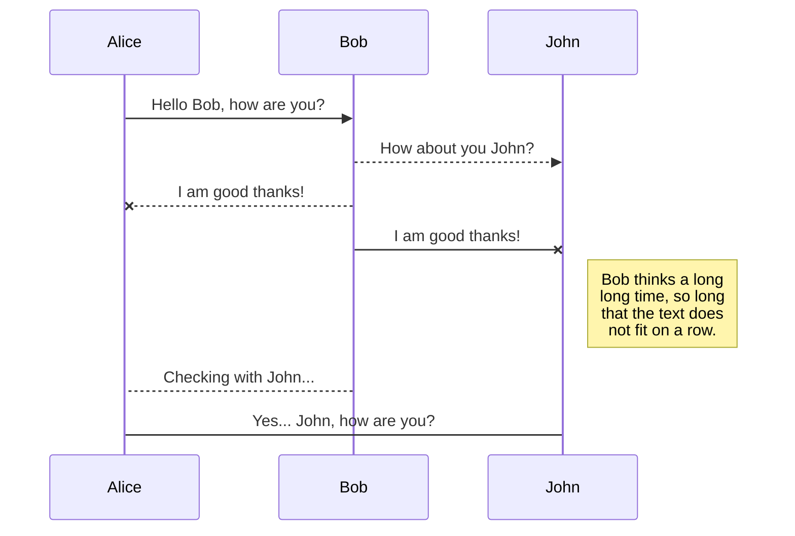
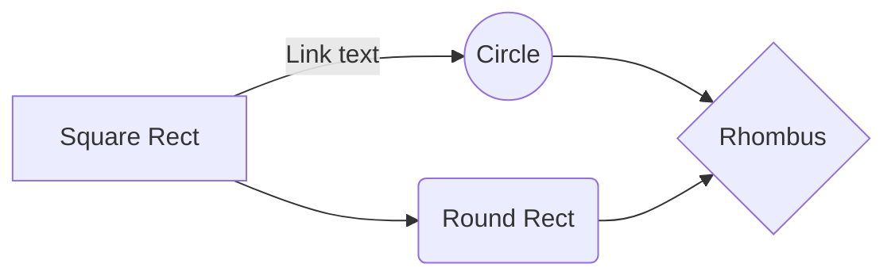

# MarbleProject 

## 참고사항
**MarbleClient.java** 444 line 
		btnStart.setVisible(ture); //*false로  변경하면 1인플로 테스트할 수 있습니다

**강조**
# 큰글씨
## 중간글씨
- li
> 보기좋게!

시연영상에 들어가야 하는것.
로그인및 단체 입장
-같은 아이디x 6자이상x
-4명 초과x 시작중인 게임x
시작버튼 1p만
주사위 굴리기
애니메이션 이동
더블이면 한번더
턴 종료시 턴 넘어감
타일 클릭시 정보 출력
다이어로그는 모달창
변경되는 자산
인원수 별 케릭터 설정
마우스 변경

타일 도착시 소유주판단 후 구매창
-땅 안고르면 구매불가
-체크되면 총 가격변동
-구매시 라벨의 색 변경
-구매한 건물이 보이게
소유주가 다른 땅은 벌금 지불

스페셜칸 이벤트 종류(세계여행 확률좀 줄이고)
스타트칸 지나면 월급
무인도 못움직이는거, 더블 시 탈출
올림픽 땅 없을 때와 있을 때
- 선택후 x2표시 x8까지?
- 벌금도 얼마나 올라가는지
세계여행 아무일도 일어나지 않는다.(돈 10원 쓰게?)
-시작 시 다이어로그와 선택장소로 이동하는 것까지. 
-월급과 도착한 땅에서 도착액션

채팅 입장시 턴 시작, 종료
파산의 경우 사라지는 케릭터와 게임오버
승리 시 보이는 화면
(진행한 턴 수 보이게끔?)

## 로그인

게임을 실행하면 아이디를 설정해야 합니다.
### 6자 이상 입력시 에러 메시지가 출력됩니다.

## 초기화면

우측에는 게임을 할 수 있는 보드판이 있으며 좌측에는 케릭터 정보창과 체팅창이 있습니다.
기본적으로는 2명 이상이어야 게임을 시작할 수 있으며 최대 4인까지 가능합니다.
### 기존에 존재하는 닉네임으로 접속시 에러창이 발생합니다. 

### 게임이 이미 시작중이거나 4명이 초과되면 에러창이 발생합니다.

### 가장 빨리 접속한 플레이어에게 게임 시작 버튼이 보이게 됩니다.

## 게임 

게임을 시작하게 되면 플레이어의 수 만큼 플레이어 케릭터가 등장하게 됩니다.
시작한 플레이어 부터 차례대로 턴을 진행하게 됩니다.
보여지는 화면은 모든 플레이어가 동일하게 보여집니다.
### 주사위를 굴리면 플레이어가 움직입니다.

### 스타트 지점을 통과하게 되면 월급을 받을 수 있습니다.

## 구매

타일이 섬 또는 도시이고 소유주가 없다면 구매를 할 수 있습니다.

도시의 경우 땅, 집, 빌딩, 호텔을 살 수 있으며 땅을 사지 않으면 구매할 수 없습니다.

체크박스를 누르면 구매 예상가격이 나오게 됩니다.
### 구매 후

구매를 하게되면 그 타일의 이름칸 색깔이 나의 색으로 바뀌게 됩니다.
보유하고 있는 자산에서 금액이 차감됩니다.
턴 종료버튼이 보여지게 됩니다.

## 벌금

섬이나 도시 타일이지만 소유주가 다른 경우에는 해당 소유주에게 벌금을 내야합니다.

만약 보유한 금액이 벌금보다 적다면 탈락하게 됩니다.

문구가 출력되며 체팅창에도 알림이 공지됩니다.

## 특수 타일

황금 열쇠가 그려진 칸에 도달하게 되면 특수한 이벤트가 발생합니다.

### 세계여행에 도착하게 되면 일단은 아무일도 일어나지 않습니다.

새로운 차례가 시작되면 세계여행을 제외한 원하는 타일을 선택할 수 있습니다.

버튼을 클릭하면 이동 후 액션을 수행합니다.

### 올림픽 타일에 도착하게 되면 자신의 타일 중 한 곳을 선택하여 통행료를 2배로 받을 수 있습니다.

## 기타 기능

### 승리 문구

- 타일을 클릭하면 정보창이 보여집니다.

# Markdown extensions

StackEdit extends the standard Markdown syntax by adding extra **Markdown extensions**, providing you with some nice features.

> **ProTip:** You can disable any **Markdown extension** in the **File properties** dialog.

## SmartyPants

SmartyPants converts ASCII punctuation characters into "smart" typographic punctuation HTML entities. For example:

|                |ASCII                          |HTML                         |
|----------------|-------------------------------|-----------------------------|
|Single backticks|`'Isn't this fun?'`            |'Isn't this fun?'            |
|Quotes          |`"Isn't this fun?"`            |"Isn't this fun?"            |
|Dashes          |`-- is en-dash, --- is em-dash`|-- is en-dash, --- is em-dash|

## KaTeX

You can render LaTeX mathematical expressions using [KaTeX](https://khan.github.io/KaTeX/):

The *Gamma function* satisfying $\Gamma(n) = (n-1)!\quad\forall n\in\mathbb N$ is via the Euler integral

$$
\Gamma(z) = \int_0^\infty t^{z-1}e^{-t}dt\,.
$$

> You can find more information about **LaTeX** mathematical expressions [here](http://meta.math.stackexchange.com/questions/5020/mathjax-basic-tutorial-and-quick-reference).

## UML diagrams

You can render UML diagrams using [Mermaid](https://mermaidjs.github.io/). For example, this will produce a sequence diagram:

And this will produce a flow chart:

