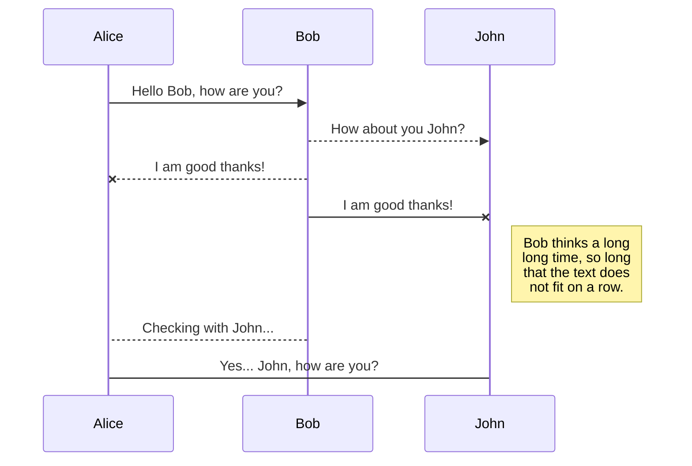
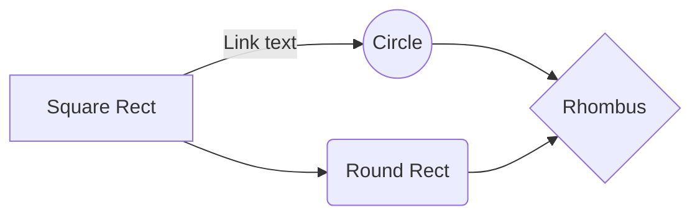

# MarbleProject 

## 참고사항
**MarbleClient.java** 444 line 
		btnStart.setVisible(false); //*true로  변경하면 1인플로 테스트할 수 있습니다.
## 수정사항
**MarbleClient.java**
		tile5와 tile 2를 변경해야 됩니다. ??
		유저가 입장했을 때 체팅으로 알려주는것

~1. 스페셜 타일 함수 ~
~2. isTurn(); 구현
	- 턴종료버튼도 구현해야됨.~
~3. 건물세우기 구현~
4. 매각 구현
5. 세계여행
 - 원하는곳으로 다음 차례 시작시 이동하게

**강조**
# 큰글씨
## 중간글씨
- li  
> 보기좋게!  

# DIALOGREQUEST  
**다이얼로그 정보 요청**  
<ol>
	<li> move함수가 실행이 되면 플레이어의 위치값과 아이디를 클라이언트에서 서버로 보냅니다. </li>
	<li> 서버에서 플레이어의 위치값과 같은 타일을 타일리스트에서 찾습니다. </li>
	<li> 클라이언트에서 받은 아이디와 같은 클라이언트에게 찾은 타일을 보냅니다. </li>
	<li> 받은 타일을 클라이언트에 static변수로 저장합니다. </li>
</ol>

# DIALOGUPDATE  
**구매하기/올림픽 시 서버와 클라이언트의 TileList Update**  
<ol>
	<li> 플레이어의 행위에 따라 타일의 상태값에 변동이 일어납니다. </li>
	<li> 변동이 일어나게 되면 상태값을 저장 후 클라이언트에서 서버로 타일을 보냅니다. </li>
	<li> 서버에서 타일을 받으면 타일리스트에서 동일한 타일을 찾습니다. </li>
	<li> 기존 타일을 받은 타일의 정보로 수정합니다. </li>
</ol>  

# PLAYERPURCHADED  
**구매 정보 전달**  
<ol>
	<li> 시티 혹은 섬의 타일 넘버와 같은 곳에 걸렸을 시 DIALOGREQUEST에서 받아온 타일의 오너를 확인합니다. </li>
	<li> 오너의 아이디가 존재하지 않으며, 나와 아이디가 같을 경우 실행됩니다. </li>
	<li> 시티 혹은 섬 타일을 구매 시 오너 아이디, 구매 내역, 통행료 정보를 클라이언트에 있는 타일 정보에 저장합니다. </li>
	<li> 변경된 정보를 DIALOGUPDATE를 통해 서버로 보내어 타일리스트에서 동일한 타일에 저장합니다. </li>
	<li> 구매한 플레이어의 아이디를 서버로 전송 후 서버에서 모든 플레이어에게 아이디와 구매금액을 전송 합니다. </li>
	<li> 전송받은 아이디와 동일한 아이디를 가진 플레이어를 찾습니다. </li>
	<li> 찾은 플레이어의 현금을 구매 가격만큼 차감합니다. </li>
</ol>  

# PLAYERFINE  
**통행료 정보 전달**  
<ol>
	<li> 시티 혹은 섬의 타일 넘버와 같은 곳에 걸렸을 시 DIALOGREQUEST에서 받아온 타일의 오너를 확인합니다. </li>
	<li> 오너의 아이디가 존재하며, 나와 아이디가 다를경우, 즉 다른 플레이어 소유의 타일일 경우 실행됩니다. </li>
	<li> 걸린 플레이어의 아이디와 오너 아이디와 통행료를 서버로 전송합니다. </li>
	<li> 서버에서 모든 플레이어에게 아이디와 오너 아이디와 통행료를 전송합니다. </li>
	<li> 전송받은 아이디와 동일한 아이디를 가진 플레이어를 찾습니다. </li>
	<li> 찾은 플레이어의 현금을 통행료 만큼 차감합니다. </li>
	<li> 같은 방식으로 오너 아이디를 가진 플레이어를 찾은 후 찾은 플레이어의 현금에 통행료 만큼 증가시킵니다. </li>
</ol>  

#PLAYERDIE  
**플레이어 게임 아웃 정보 전달**  
<ol>
	<li> 플레이어의 현금이 0원이 되었을 때 실행합니다. </li>
	<li> 현금이 0원이된 플레이어의 아이디를 서버로 전송합니다. </li>
	<li> 타일리스트의 타일에 저장되어있는 오너 아이디가 NULL 값이 아니고 받은 아이디와 타일리스트의 타일에 저장되어있는 오너 아이디와 같은 아이디를 찾습니다. </li>
	<li> 찾은 타일의 오너 정보를 국가로 변경 합니다. </li>
</ol>  

#PLAYERLISTOUT  
**플레이어 리스트 아웃**  
<ol>
	<li> 아웃된 플레이어의 아이디를 서버로 전송합니다. </li>
	<li> 플레이 리스트에 저장되어있는 플레이어의 ISPLAYING 값을 FALSE로 변경합니다. </li>
	<li> 모든 클라이언트에게 False로 변경된 아이디를 전송합니다. </li>
	<li> 클라이언트에서 같은 아이디를 가진 플레이어는 ISPLAYING 값을 FALSE로 변경합니다. </li>
	<li> 모든 클라이언트는 받은 아이디값을 가진 플레이어의 이미지를 FALSE로 변경하여 게임화면에서 지웁니다. </li>
</ol>  

#PLAYERBUILD  
**플레이어 건물 생성**  
<ol>
	<li>  </li>
	<li>  </li>
	<li>  </li>
	<li>  </li>
</ol>  

#PLAYERISLAND 
**플레이어 아일랜드 땅 구매**  
<ol>
	<li>  </li>
	<li>  </li>
	<li>  </li>
	<li>  </li>
</ol>  

#TILELISTPULL 
**서버로부터 타일리스트 pull**  
<ol>
	<li>  </li>
	<li>  </li>
	<li>  </li>
	<li>  </li>
</ol>  

#INITTURN  
**플레이어 첫 턴**  
<ol>
	<li>  </li>
	<li>  </li>
	<li>  </li>
	<li>  </li>
</ol>  

Synchronization is one of the biggest features of StackEdit. It enables you to synchronize any file in your workspace with other files stored in your **Google Drive**, your **Dropbox** and your **GitHub** accounts. This allows you to keep writing on other devices, collaborate with people you share the file with, integrate easily into your workflow... The synchronization mechanism takes place every minute in the background, downloading, merging, and uploading file modifications.

There are two types of synchronization and they can complement each other:

- The workspace synchronization will sync all your files, folders and settings automatically. This will allow you to fetch your workspace on any other device.
	> To start syncing your workspace, just sign in with Google in the menu.

- The file synchronization will keep one file of the workspace synced with one or multiple files in **Google Drive**, **Dropbox** or **GitHub**.
	> Before starting to sync files, you must link an account in the **Synchronize** sub-menu.

## Open a file

You can open a file from **Google Drive**, **Dropbox** or **GitHub** by opening the **Synchronize** sub-menu and clicking **Open from**. Once opened in the workspace, any modification in the file will be automatically synced.

## Save a file

You can save any file of the workspace to **Google Drive**, **Dropbox** or **GitHub** by opening the **Synchronize** sub-menu and clicking **Save on**. Even if a file in the workspace is already synced, you can save it to another location. StackEdit can sync one file with multiple locations and accounts.

## Synchronize a file

Once your file is linked to a synchronized location, StackEdit will periodically synchronize it by downloading/uploading any modification. A merge will be performed if necessary and conflicts will be resolved.

If you just have modified your file and you want to force syncing, click the **Synchronize now** button in the navigation bar.

> **Note:** The **Synchronize now** button is disabled if you have no file to synchronize.

## Manage file synchronization

Since one file can be synced with multiple locations, you can list and manage synchronized locations by clicking **File synchronization** in the **Synchronize** sub-menu. This allows you to list and remove synchronized locations that are linked to your file.

# Publication

Publishing in StackEdit makes it simple for you to publish online your files. Once you're happy with a file, you can publish it to different hosting platforms like **Blogger**, **Dropbox**, **Gist**, **GitHub**, **Google Drive**, **WordPress** and **Zendesk**. With [Handlebars templates](http://handlebarsjs.com/), you have full control over what you export.

> Before starting to publish, you must link an account in the **Publish** sub-menu.

## Publish a File

You can publish your file by opening the **Publish** sub-menu and by clicking **Publish to**. For some locations, you can choose between the following formats:

- Markdown: publish the Markdown text on a website that can interpret it (**GitHub** for instance),
- HTML: publish the file converted to HTML via a Handlebars template (on a blog for example).

## Update a publication

After publishing, StackEdit keeps your file linked to that publication which makes it easy for you to re-publish it. Once you have modified your file and you want to update your publication, click on the **Publish now** button in the navigation bar.

> **Note:** The **Publish now** button is disabled if your file has not been published yet.

## Manage file publication

Since one file can be published to multiple locations, you can list and manage publish locations by clicking **File publication** in the **Publish** sub-menu. This allows you to list and remove publication locations that are linked to your file.

# Markdown extensions

StackEdit extends the standard Markdown syntax by adding extra **Markdown extensions**, providing you with some nice features.

> **ProTip:** You can disable any **Markdown extension** in the **File properties** dialog.

## SmartyPants

SmartyPants converts ASCII punctuation characters into "smart" typographic punctuation HTML entities. For example:

|                |ASCII                          |HTML                         |
|----------------|-------------------------------|-----------------------------|
|Single backticks|`'Isn't this fun?'`            |'Isn't this fun?'            |
|Quotes          |`"Isn't this fun?"`            |"Isn't this fun?"            |
|Dashes          |`-- is en-dash, --- is em-dash`|-- is en-dash, --- is em-dash|

## KaTeX

You can render LaTeX mathematical expressions using [KaTeX](https://khan.github.io/KaTeX/):

The *Gamma function* satisfying $\Gamma(n) = (n-1)!\quad\forall n\in\mathbb N$ is via the Euler integral

$$
\Gamma(z) = \int_0^\infty t^{z-1}e^{-t}dt\,.
$$

> You can find more information about **LaTeX** mathematical expressions [here](http://meta.math.stackexchange.com/questions/5020/mathjax-basic-tutorial-and-quick-reference).

## UML diagrams

You can render UML diagrams using [Mermaid](https://mermaidjs.github.io/). For example, this will produce a sequence diagram:

And this will produce a flow chart:

