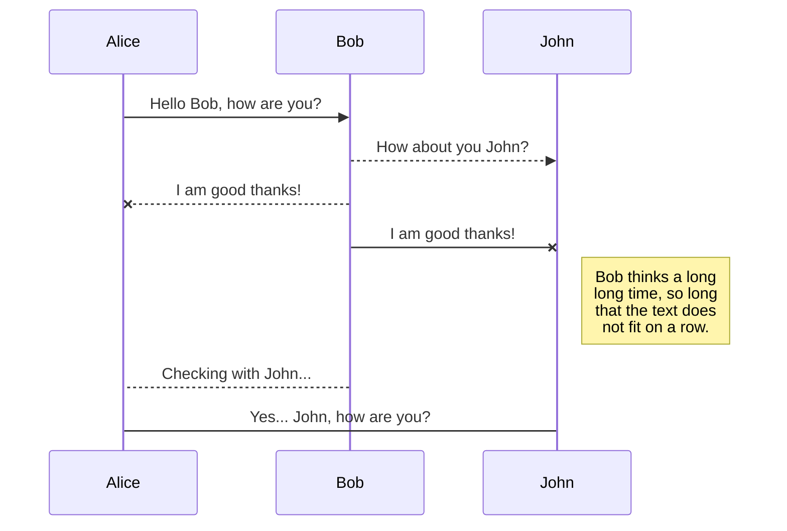
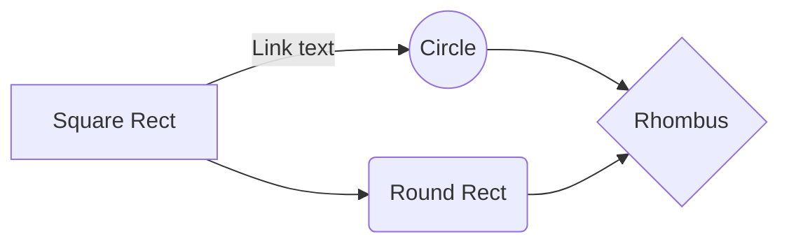

# MarbleProject 

## 서버 구동 방법
**MableLauncher.java**  
MarbleLauncher.java를 구동하면 MarbleServer가 실행됩니다.

## 클라이언트 구동 방법
**MarbleLogin.java**  
		MarbleServer가 실행된 상태면, MarbleLogin.java를 통해 아이디를 입력한 후 로그인할 수 있습니다.

## 활용 라이브러리
** gson ** : 서버와 클라이언트 간 소켓 통신 시 toJson, fromJson을 통해 RequestDto 클래스를 이용하였습니다.  
** lombok ** : Player 객체, Tile 객체 내부의 변수를 get/set 하기 위해 이용하였습니다.

## 참고사항
**MarbleClient.java** 444 line   
		btnStart.setVisible(false); // *true로  변경하면 1인플로 테스트할 수 있습니다.

## 수정사항

# IDSET
** 플레이어 로그인 시 로그인창에 입력한 ID값을 서버로 전송하는 기능 **

# IDCHECK
** IDSET 시 이미 서버상에 존재하는 ID면 접속이 불가능하게 하는 기능 **  

# GAMEHOST
** 방장이 된 플레이어의 클라이언트의 시작버튼을 활성화하는 기능 **  
<ol>
	<li> 플레이어가 접속할 때마다 서버의 playerList(접속중인 플레이어를 담은 Vector)를 확인합니다.
	<li> 2명 이상이 되면 playerList의 0번 인덱스 유저 클라이언트의 '시작버튼'을 활성화합니다.
</ol>

# GAMESTART
** 방장이 '시작버튼'을 누르면 서버의 시작여부 함수를 변경하고 시작을 알리는 기능 **
<ol>
	<li> 서버의 시작여부 변수(isPlaying)를 true로 변경합니다. // default : false  
	<li> PLAYERSET 프로토콜을 사용하여 클라이언트의 Player 객체의 ID값을 변경합니다.
	<li> CHAT 프로토콜을 사용하여 모든 플레이어에게 게임 시작을 알립니다.
	<li> INITTURN 프로토콜을 사용하여 방장 플레이어에게 턴을 넘겨줍니다.
</ol>
	

# PLAYERSET
** 서버로부터 각 플레이어의 ID값을 받아 클라이언트에 있는 Player 객체의 ID값을 변경하는 기능 **  
<ol>
	<li> 서버의 countPlayer 변수를 접속중인 플레이어 수만큼 지정합니다. (승리/패배 확인을 위해)
	<li> 플레이어의 수만큼 차례대로 클라이언트의 player1, 2, 3, 4의 ID값을 설정해줍니다.
	<li> 클라이언트는 ID값이 존재하는 플레이어들의 이미지를 활성화시킵니다.
	<li> 또한, 오른쪽 플레이어 정보창도 활성화시킵니다.
</ol>

# DICEROLL
** 클라이언트의 '주사위 굴리기' 버튼을 누르면 1~6 랜덤값 두 개를 서버로 보내는 기능 **  
<ol>
	<li> 클라이언트에 존재하는 '주사위 굴리기' 버튼을 누르면 playerRoll 함수가 실행됩니다.
	<li> playerRoll 함수가 실행되면, DICEROLL 프로토콜을 사용하여 서버로 주사위 값을 보냅니다.
	<li> 서버는 받은 주사위값을 접속중인 모든 클라이언트에게 보냅니다.
	<li> 클라이언트는 서버로부터 받은 주사위값을 클라이언트 화면에 출력합니다.
</ol>

# MOVE
** 주사위를 굴린 플레이어의 캐릭터의 발판위치를 변경하는 기능 **  
<ol>
	<li> 주사위를 굴린 플레이어의 ID를 받아서 player1, 2, 3, 4 중 해당 플레이어 번호를 찾습니다.
	<li> 클라이언트에서는 플레이어 객체의 moveAnimation을 이용하여 확인된 해당 플레이어 번호의 캐릭터를 움직입니다.
</ol>

# 큰글씨
## 중간글씨
- li
> 보기좋게!

# Synchronization

Synchronization is one of the biggest features of StackEdit. It enables you to synchronize any file in your workspace with other files stored in your **Google Drive**, your **Dropbox** and your **GitHub** accounts. This allows you to keep writing on other devices, collaborate with people you share the file with, integrate easily into your workflow... The synchronization mechanism takes place every minute in the background, downloading, merging, and uploading file modifications.

There are two types of synchronization and they can complement each other:

- The workspace synchronization will sync all your files, folders and settings automatically. This will allow you to fetch your workspace on any other device.
	> To start syncing your workspace, just sign in with Google in the menu.

- The file synchronization will keep one file of the workspace synced with one or multiple files in **Google Drive**, **Dropbox** or **GitHub**.
	> Before starting to sync files, you must link an account in the **Synchronize** sub-menu.

## Open a file

You can open a file from **Google Drive**, **Dropbox** or **GitHub** by opening the **Synchronize** sub-menu and clicking **Open from**. Once opened in the workspace, any modification in the file will be automatically synced.

## Save a file

You can save any file of the workspace to **Google Drive**, **Dropbox** or **GitHub** by opening the **Synchronize** sub-menu and clicking **Save on**. Even if a file in the workspace is already synced, you can save it to another location. StackEdit can sync one file with multiple locations and accounts.

## Synchronize a file

Once your file is linked to a synchronized location, StackEdit will periodically synchronize it by downloading/uploading any modification. A merge will be performed if necessary and conflicts will be resolved.

If you just have modified your file and you want to force syncing, click the **Synchronize now** button in the navigation bar.

> **Note:** The **Synchronize now** button is disabled if you have no file to synchronize.

## Manage file synchronization

Since one file can be synced with multiple locations, you can list and manage synchronized locations by clicking **File synchronization** in the **Synchronize** sub-menu. This allows you to list and remove synchronized locations that are linked to your file.

# Publication

Publishing in StackEdit makes it simple for you to publish online your files. Once you're happy with a file, you can publish it to different hosting platforms like **Blogger**, **Dropbox**, **Gist**, **GitHub**, **Google Drive**, **WordPress** and **Zendesk**. With [Handlebars templates](http://handlebarsjs.com/), you have full control over what you export.

> Before starting to publish, you must link an account in the **Publish** sub-menu.

## Publish a File

You can publish your file by opening the **Publish** sub-menu and by clicking **Publish to**. For some locations, you can choose between the following formats:

- Markdown: publish the Markdown text on a website that can interpret it (**GitHub** for instance),
- HTML: publish the file converted to HTML via a Handlebars template (on a blog for example).

## Update a publication

After publishing, StackEdit keeps your file linked to that publication which makes it easy for you to re-publish it. Once you have modified your file and you want to update your publication, click on the **Publish now** button in the navigation bar.

> **Note:** The **Publish now** button is disabled if your file has not been published yet.

## Manage file publication

Since one file can be published to multiple locations, you can list and manage publish locations by clicking **File publication** in the **Publish** sub-menu. This allows you to list and remove publication locations that are linked to your file.

# Markdown extensions

StackEdit extends the standard Markdown syntax by adding extra **Markdown extensions**, providing you with some nice features.

> **ProTip:** You can disable any **Markdown extension** in the **File properties** dialog.

## SmartyPants

SmartyPants converts ASCII punctuation characters into "smart" typographic punctuation HTML entities. For example:

|                |ASCII                          |HTML                         |
|----------------|-------------------------------|-----------------------------|
|Single backticks|`'Isn't this fun?'`            |'Isn't this fun?'            |
|Quotes          |`"Isn't this fun?"`            |"Isn't this fun?"            |
|Dashes          |`-- is en-dash, --- is em-dash`|-- is en-dash, --- is em-dash|

## KaTeX

You can render LaTeX mathematical expressions using [KaTeX](https://khan.github.io/KaTeX/):

The *Gamma function* satisfying $\Gamma(n) = (n-1)!\quad\forall n\in\mathbb N$ is via the Euler integral

$$
\Gamma(z) = \int_0^\infty t^{z-1}e^{-t}dt\,.
$$

> You can find more information about **LaTeX** mathematical expressions [here](http://meta.math.stackexchange.com/questions/5020/mathjax-basic-tutorial-and-quick-reference).

## UML diagrams

You can render UML diagrams using [Mermaid](https://mermaidjs.github.io/). For example, this will produce a sequence diagram:

And this will produce a flow chart:

